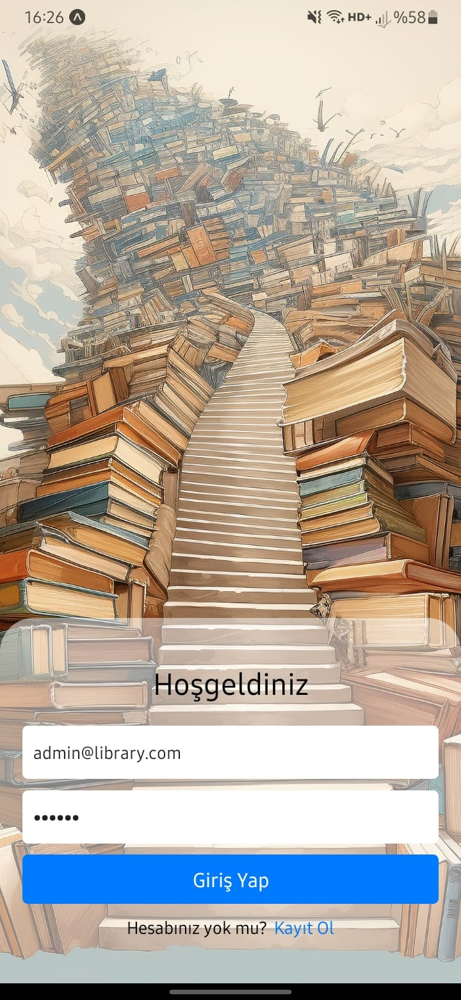
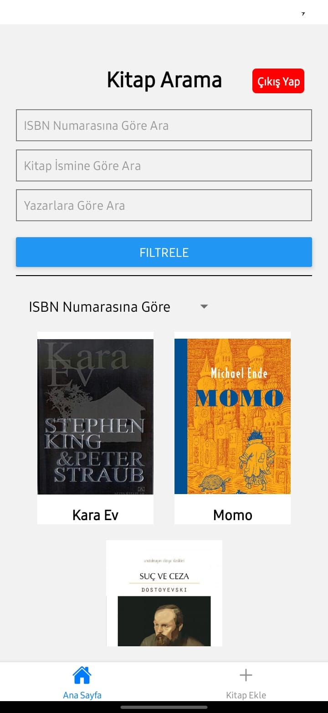
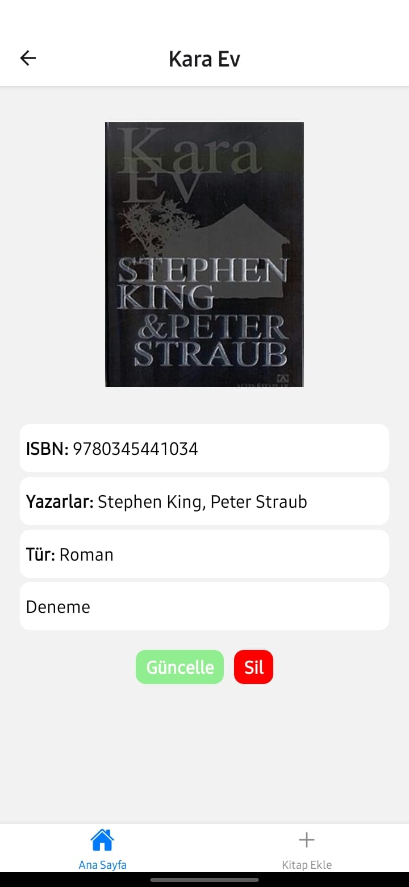
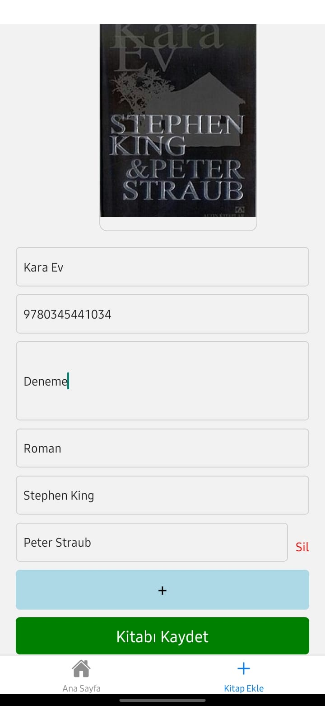
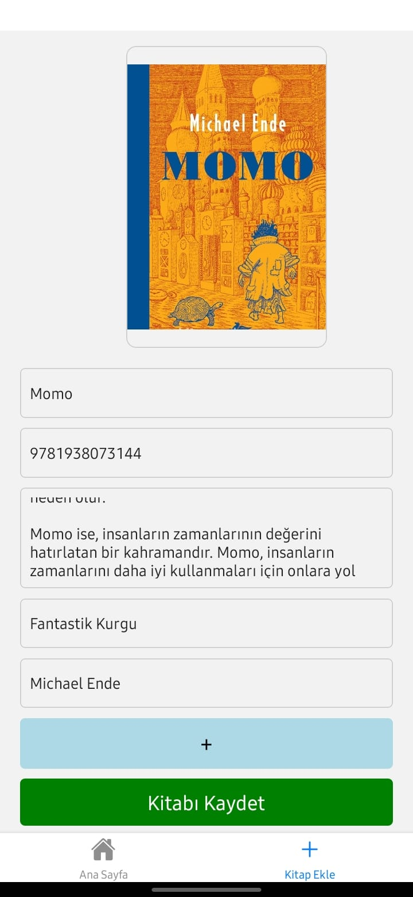

# Uygulama Dosyası
Uygulamayı denemek isterseniz [bağlantı](https://expo.dev//accounts/keremcankurt/projects/LibraryApp/builds/53a9d151-1fe8-469d-bf84-b5784d92d85b) 'dan apk dosyasını indirebilirsiniz.
# Kurulum ve Çalıştırma
## Kütüphanelerin yüklenmesi
`npm i` komutu ile gerekli kütüphaneleri yüklemelisiniz
## Çalıştırma
`npm start` komutu ile çalıştırarak expo uygulamasından görüntüleyebilirsiniz.

## Giriş bilgileri
### Admin Girişi
`Email:` `admin@library.com`

`Şifre:` `123456` 
### Kullanıcı Girişi
`Email:` `user@library.com` 

`Şifre:` `123456` 

# Uygulamadan Görüntüler

  
  
  
  
  

